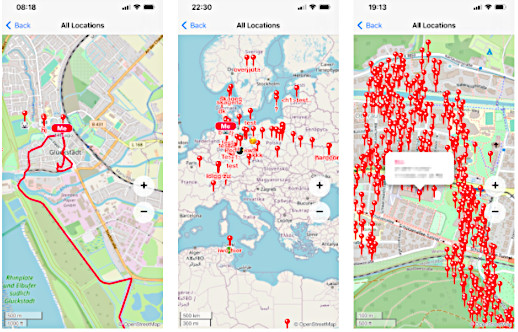

# leaflet on webxdc

this little demonstration shows a map using [leaflet](https://leafletjs.com) in a [webxdc](https://webxdc.org) mini app.

the map needs `internet_access` to be enabled, which currently requires the app to be used in "Saved Messages"
of Delta Chat with https://github.com/deltachat/deltachat-android/pull/2378 (the feature is not yet released anywhere).



[Download .xdc from Release Assets](https://github.com/r10s/maps/releases), attach to "Saved Messages" as described above and travel the world!

[Online Demo](https://r10s.github.io/maps/)

## Building

to create a `.xdc` file that can be attached to a Delta Chat group, execute:

```sh
./create-xdc.sh
```
