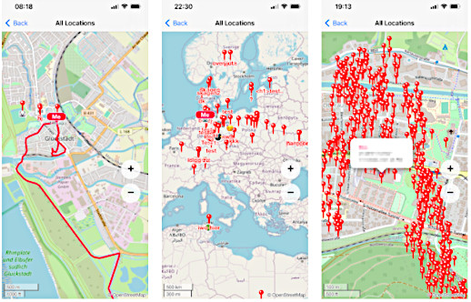

# Maps Integration for Delta Chat clients

> An "Integration" is a [webxdc file](https://webxdc.org)
> that speaks to the deltachat-core-library instead of other webxdc instances.
> From the view of the messenger implementor, the integrations behave like a normal webxdc.

To use this integration in a client,
get a [core](https://github.com/deltachat/deltachat-core-rust/) with 1.137.4 or newer,
build `maps.xdc` as described below,
add it to the client using
[`dc_set_webxdc_integration()`/`dc_init_webxdc_integration()`](https://c.delta.chat/classdc__context__t.html#a60fd03f7cae5046ed2b33c095f41eec2)
and open it as a usual webxdc.

The map is shown using [Leaflet](https://leafletjs.com) and looks like the following:



The protocol used to speak to core is described atop of
[`maps_integration.rs`](https://github.com/deltachat/deltachat-core-rust/blob/main/src/webxdc/maps_integration.rs).

Compared to eg. Mapbox on Android, this solution is
[8mb smaller and has 2000+ lines less boilerplate code](https://github.com/deltachat/deltachat-android/pull/3005#pullrequestreview-2022776484).

In general, however, the integration could use other maps as well,
it is not bound to Leaflet.

[Online Demo](https://deltachat.github.io/maps/)

## Building

to create `maps.xdc` file, execute:

```sh
./create-xdc.sh
```

Note, that `maps.xdc` is meant to be used as an integration as described below and will work only limited when send to a chat.


## Development Preview with webxdc-dev

Use [webxdc-dev](https://github.com/deltachat/webxdc-dev) to preview the app with multiple simulated instances.
Run it against the **source directory** (not the `.xdc` file) so that dev-only files are available and with the parameter --no-csp to allow the map tiles to be loaded:

```sh
webxdc-dev run --no-csp .
```


### GPS Simulation

A GPS sender can be simulated for development purposes.
`simulate.js` is loaded automatically when running from the directory
and is excluded from the production `.xdc` build.

1. Open browser DevTools (`F12`)
2. In the **Console** tab, click the context dropdown (top-left, shows `top`) and select one of the iframe instances (localhost:<port>)
3. Call `simulateGps()` in the console:

```js
// Default: "SimUser" near Munich, 30 updates, 1.5s interval
simulateGps()

// Custom sender
simulateGps({ name: "Alice", lat: 52.52, lng: 13.405, color: "#e74c3c", steps: 50, intervalMs: 800 })

// Multiple senders at once
simulateGps({ name: "Bob",   lat: 48.2, lng: 16.37 })
simulateGps({ name: "Carol", lat: 51.5, lng: -0.12 })

// Stop all running simulations
stopSimulateGps()
```

| Option | Default | Description |
|---|---|---|
| `name` | `"SimUser"` | Display name shown on the map |
| `color` | random | Hex color for the track marker |
| `lat` / `lng` | `48.137` / `11.576` | Starting coordinates |
| `steps` | `30` | Number of position updates to send |
| `intervalMs` | `1500` | Milliseconds between updates |
| `drift` | `0.001` | Max random movement per step (~100 m) |


## Replace Integrations

Webxdc developers can replace the shipped `maps.xdc` with a custom version.

For that purpose:

- In `manifest.toml`, add the entry `request_integration = map`
  (this is already true if you use this repository as a template)

- Attach the `.xdc` to the "Saved Messages" chat of Delta Chat and forward it again to "Saved messages".
  If things work out, the summary will read "🌍 Used as map. Delete to use default"

When now tapping the generic map symbol _inside any chat_,
the map replacement is started instead of the shipped one.

Note, that this has to be done locally.
In a multi-device-setup, you have to perform this action for every device.

The replacing is experimental and not meant for end users yet but for Webxdc developers.
